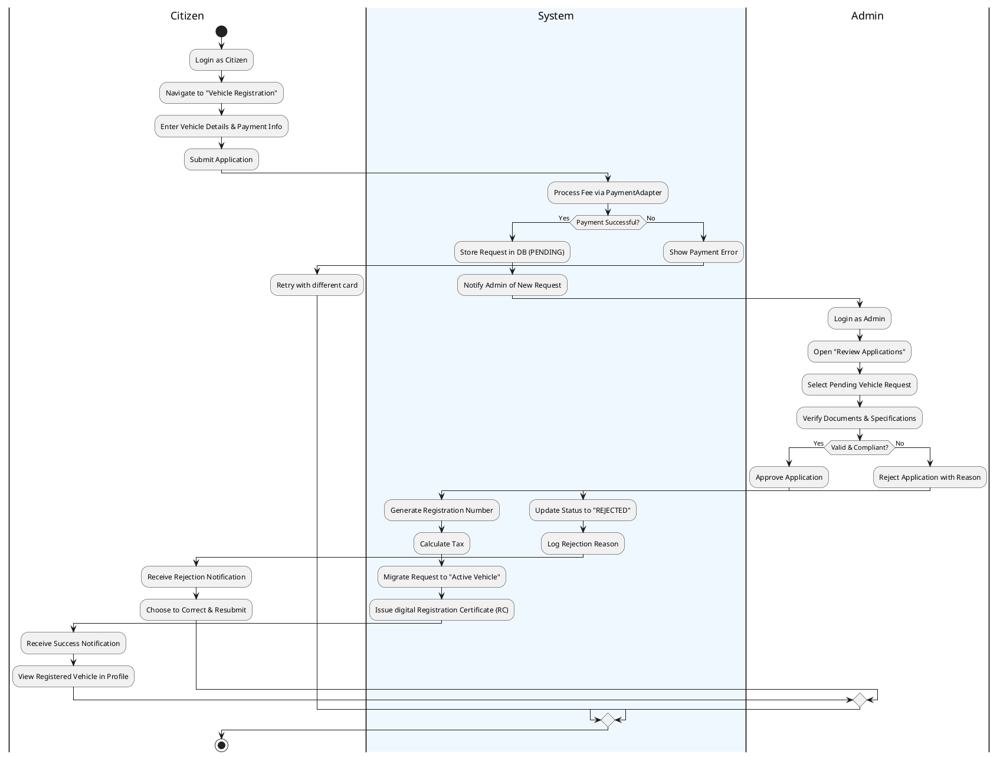

# RTO Office Simulation - UML Activity Diagram

## CBT Test Process (Learner's License)

This activity diagram demonstrates the operational workflow of the Computer Based Test (CBT) for obtaining a Learner's License.

```plantuml
@startuml CBT_Activity_Diagram

|Citizen|
start
:Login to RTO System;
:Open "Take LL Test" Page;

|#F0F8FF|System|
:Load Previous Test History;
:Display Welcome Screen & Instructions;

|Citizen|
:Click "Start Test" Button;

|System|
:Fetch 10 Random Questions from DB;
:Initialize & Start 10-Minute Timer;
:Display First Question;

repeat
  |Citizen|
  :Select an Option (A/B/C/D);
  :Click Next/Previous or Scroll;
repeat while (All questions answered OR Timer Active?) is (Yes)

|Citizen|
if (Submit Button Clicked?) then (Yes)
  if (All Questions Answered?) then (No)
    :View Confirmation Dialog;
    if (Confirm Submission?) then (No)
      detach
    endif
  endif
else (No - Timer Expired)
  |System|
  :Auto-Submit Test;
endif

|System|
:Stop Timer;
:Grade Answers against DB Keys;
:Calculate Score (X/10);

if (Score >= 6 PPG (60%)?) then (Yes)
  :Display "PASSED" Result;
  :Auto-Issue Learner's License;
  :Update User Record in DB;
else (No)
  :Display "FAILED" Result;
  :Provide Option to Retake Later;
endif

:Display Final Result Summary;
stop

@enduml
```

### Key Logic Steps:
1. **Pre-Test**: The system displays history and instructions to ensure the user is prepared.
2. **Interactive Phase**: The user can cycle through questions. A concurrent timer keeps track of the remaining time.
3. **Decision Point (Submission)**: Handles both manual submission (with an "incomplete" warning) and automatic submission on time exhaustion.
4. **Post-Processing**: The system evaluates the session. A score of 6/10 is the threshold for the automatic issuance of the Learner's License.

---

## 2. Vehicle Registration Process

This diagram shows the end-to-end workflow of registering a vehicle, covering both the Citizen's submission and the Admin's approval.



### Process Highlights:
1. **Separation of Concerns**: The Citizen handles the data entry and payment, while the Admin handles the verification.
2. **Persistence**: The system maintains the state in the database during the "PENDING" phase.
3. **Outcome**: Leads to either a functional Vehicle record or a documented rejection that allows for rework.

