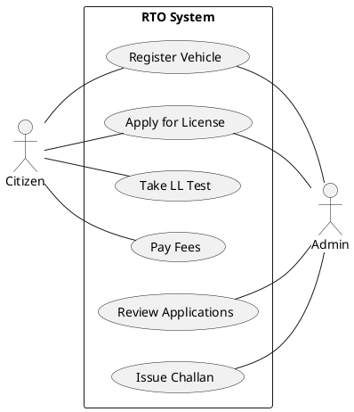
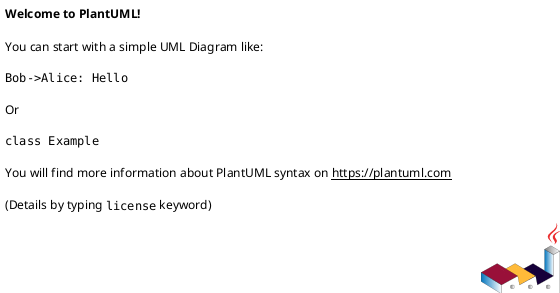
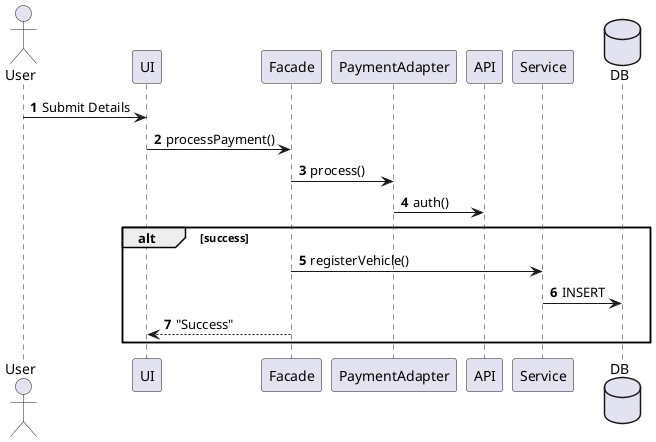
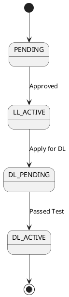
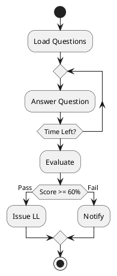
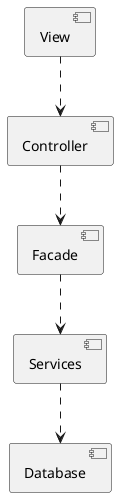
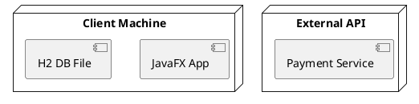

# RTO Management System - Consolidated PlantUML Codes

This document contains all the PlantUML source codes for the project's UML documentation.

---

## 1. Use Case Diagram (Summary)
*Individual use case diagrams and specifications are located in [use_case_diagram.md](file:///c:/Users/saira/OneDrive/Desktop/RTO_Office_Simulation_Using_Java/docs/use_case_diagram.md)*

---

## 2. Class Diagram
*Full details in [class_diagram.md](file:///c:/Users/saira/OneDrive/Desktop/RTO_Office_Simulation_Using_Java/docs/class_diagram.md)*

*(Note: Due to size, please refer to [class_diagram.md](file:///c:/Users/saira/OneDrive/Desktop/RTO_Office_Simulation_Using_Java/docs/class_diagram.md) for the full 46-class design diagram.)*

---

## 3. Sequence Diagrams
*Full set in [sequence_diagram.md](file:///c:/Users/saira/OneDrive/Desktop/RTO_Office_Simulation_Using_Java/docs/sequence_diagram.md)*

### Example: Vehicle Registration

---

## 4. State Diagrams
*Details in [state_diagram.md](file:///c:/Users/saira/OneDrive/Desktop/RTO_Office_Simulation_Using_Java/docs/state_diagram.md)*

### License Lifecycle

---

## 5. Activity Diagrams
*Details in [activity_diagram.md](file:///c:/Users/saira/OneDrive/Desktop/RTO_Office_Simulation_Using_Java/docs/activity_diagram.md)*

### CBT Test Flow

---

## 6. Architectural Diagrams (Component & Deployment)
*Details in [architectural_diagrams.md](file:///c:/Users/saira/OneDrive/Desktop/RTO_Office_Simulation_Using_Java/docs/architectural_diagrams.md)*

### Component Diagram

### Deployment Diagram

