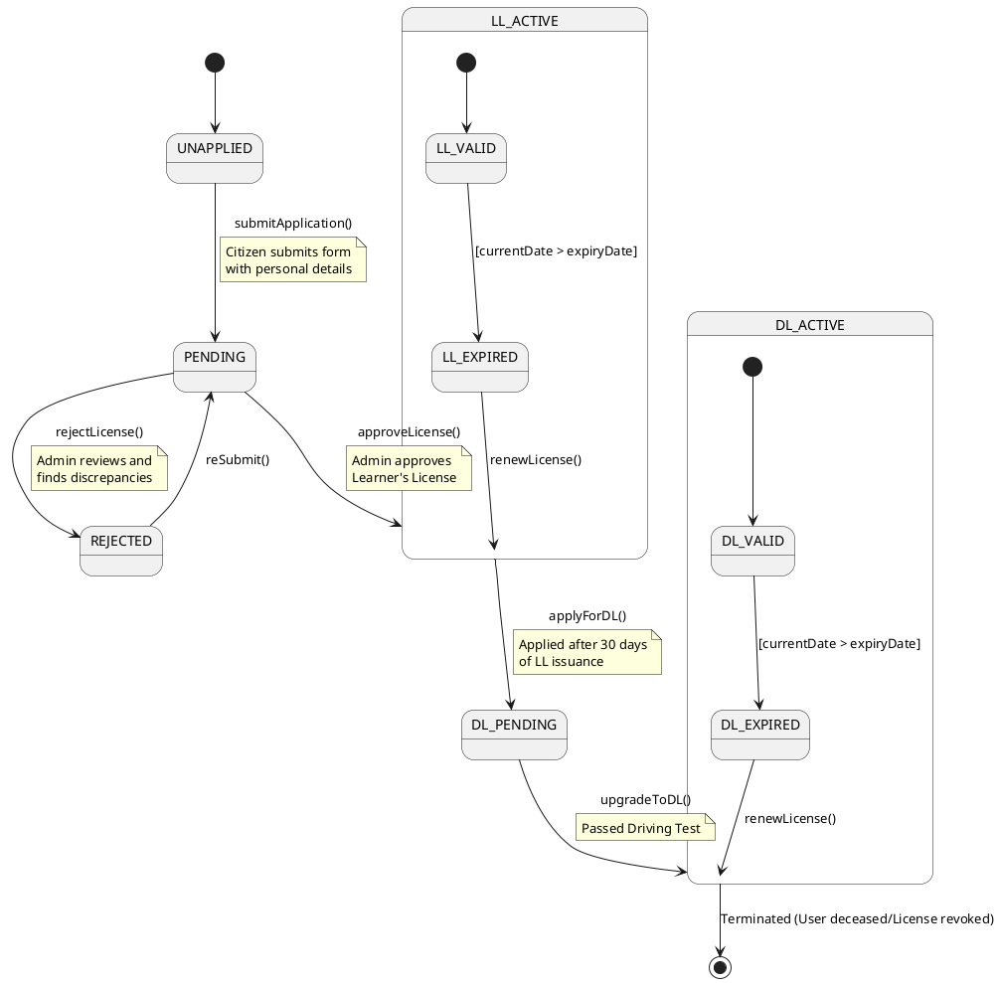
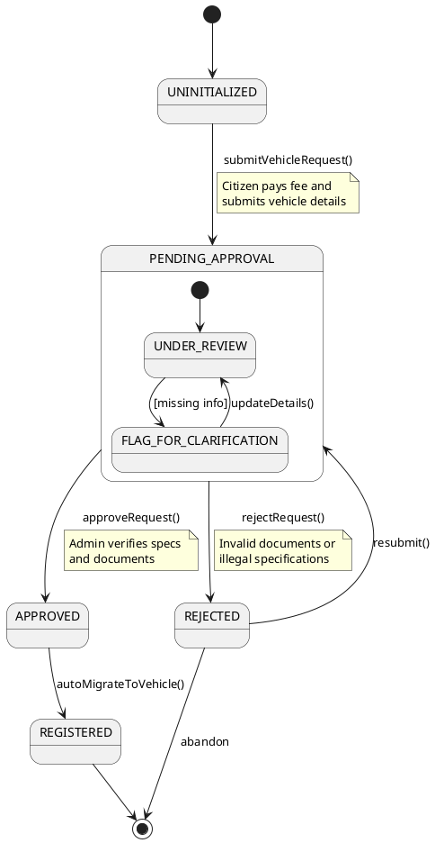

# RTO Office Simulation - UML State Machine Diagram

## License Lifecycle

This state machine diagram describes the lifecycle of a Driving License in the system, from initial application to permanent status.

### State Descriptions:
1. **PENDING**: The application has been submitted and is awaiting review by an RTO Officer.
2. **REJECTED**: The application was denied. The user can correct issues and resubmit.
3. **LL_ACTIVE**: The user has a valid Learner's License. They are eligible to practice and later apply for a DL.
4. **DL_PENDING**: The user has applied for a permanent Driving License and is awaiting the practical test/approval.
5. **DL_ACTIVE**: The user possesses a full, permanent Driving License.
6. **EXPIRED**: The license has passed its validity period and requires renewal to become active again.

---

## 2. Vehicle Request Lifecycle

This diagram shows the states a vehicle registration request goes through when initiated by a citizen.

### State Descriptions:
1. **PENDING_APPROVAL**: The request is in the admin's queue, being checked for compliance.
2. **FLAG_FOR_CLARIFICATION**: A sub-state where the admin has asked the citizen for more information or a better document scan.
3. **APPROVED**: The admin has cleared the request for registration.
4. **REGISTERED**: The final state where the request is converted into a full Vehicle record with a generated Registration Number.
5. **REJECTED**: The request was denied. The citizen can choose to fix the issue or abandon the request.
