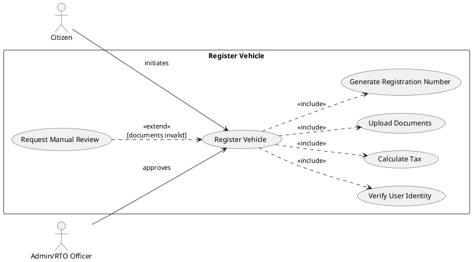
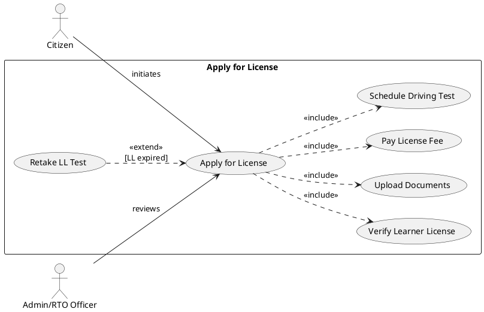
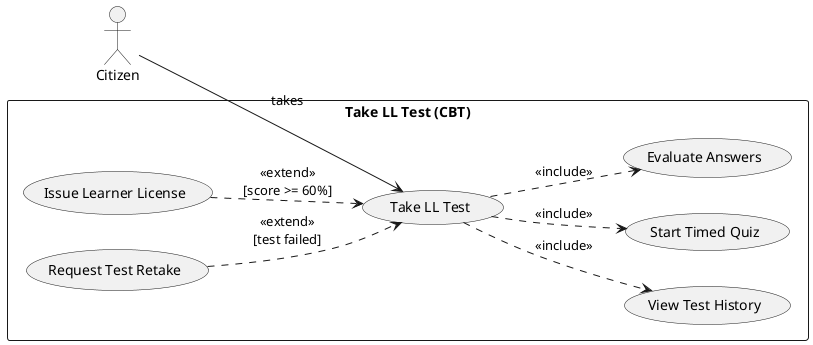
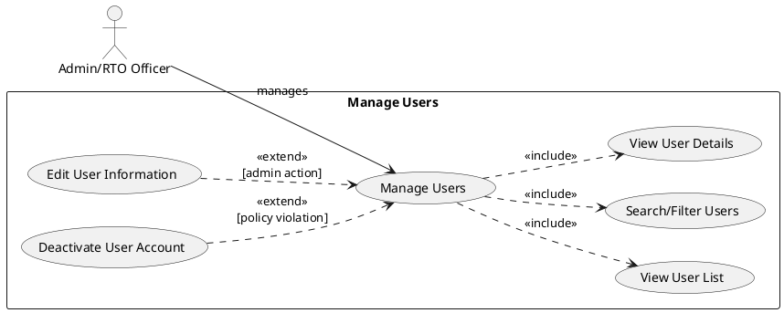
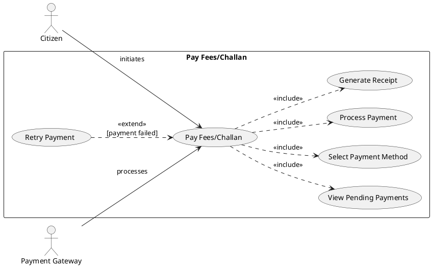
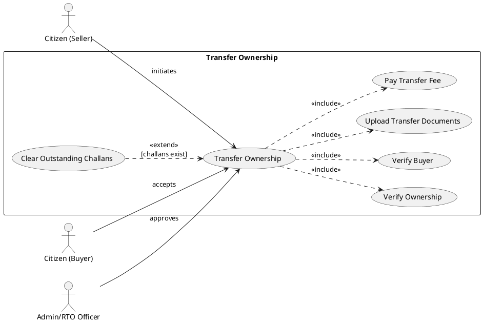
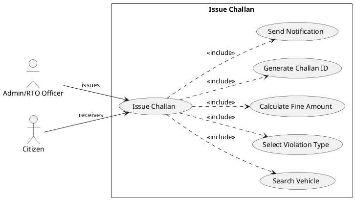
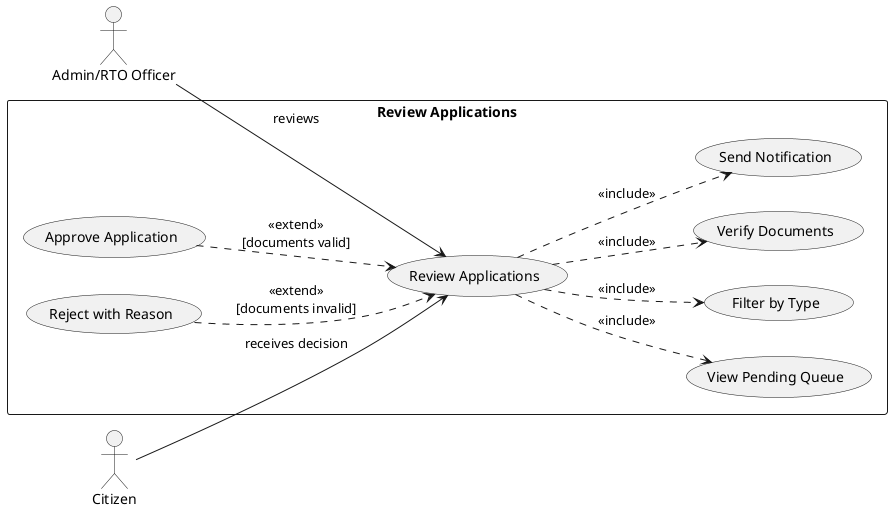

# RTO Office Simulation - Use Case Diagrams and Specifications

---

# MAJOR USE CASES (4)

---

## 1. Use Case: Register Vehicle

### PlantUML Diagram

### Use Case Specification

**Use Case Name:** Register Vehicle

● **Description:** This use case describes the process by which a citizen registers a new vehicle with the RTO office, including identity verification, tax calculation, document upload, and generation of a unique registration number.

● **Actors:** Citizen (Primary), Admin/RTO Officer (Supporting).

● **Pre-condition:** The Citizen must be logged into the system and must possess a valid Driving License or Learner's License.

● **Post-condition:** The vehicle is registered in the system with a unique registration number (e.g., KA-01-AB-1234), and the database is updated with vehicle and owner details.

● **Basic Flow:**
  ○ Citizen navigates to the Vehicle Registration module from the dashboard.
  ○ Citizen selects vehicle type (Car, Bike, or Truck).
  ○ Citizen enters vehicle details (make, model, engine number, chassis number, specifications).
  ○ System verifies user identity against registered credentials (Includes "Verify User Identity").
  ○ System calculates applicable road tax based on vehicle type and specifications (Includes "Calculate Tax").
  ○ Citizen uploads required documents (insurance certificate, purchase invoice, pollution certificate).
  ○ System validates uploaded documents and generates a unique registration number.
  ○ System records the registration with current timestamp and owner details.
  ○ System displays a confirmation message with the registration certificate.

● **Alternate Flow (Incomplete Documents):** At step 6, if any required document is missing or invalid, the system highlights the missing/invalid documents and prompts the Citizen to re-upload before proceeding. The registration remains in "PENDING" status.

● **Exception Flow (Duplicate Vehicle):** At step 7, if the chassis number or engine number already exists in the database, the system rejects the registration with error message: "This vehicle is already registered in the system. Please contact RTO office for clarification."

---

## 2. Use Case: Apply for License

### PlantUML Diagram

### Use Case Specification

**Use Case Name:** Apply for License

● **Description:** This use case handles the process of a citizen applying for a permanent Driving License (DL) after successfully obtaining a Learner's License and completing the mandatory waiting period of 30 days.

● **Actors:** Citizen (Primary), Admin/RTO Officer (Supporting).

● **Pre-condition:** The Citizen must be logged into the system and must possess a valid Learner's License (LL) that was issued at least 30 days prior to the application date.

● **Post-condition:** The license application is submitted successfully with status "PENDING", and the Admin is notified for review and approval.

● **Basic Flow:**
  ○ Citizen navigates to the License Application module from the dashboard.
  ○ System retrieves and displays citizen's Learner License details.
  ○ System verifies that LL was issued at least 30 days ago (Includes "Verify Learner License").
  ○ Citizen selects desired license type (Two-Wheeler, Four-Wheeler, Commercial, or All).
  ○ Citizen uploads required documents (LL copy, address proof, medical fitness certificate, photographs).
  ○ System calculates the applicable license fee based on license type.
  ○ Citizen proceeds to payment gateway (Includes "Pay License Fee").
  ○ System generates a unique Application ID and sets status to "PENDING".
  ○ System notifies Admin about the new pending application.
  ○ System displays confirmation message with Application ID to the Citizen.

● **Alternate Flow (Waiting Period Not Complete):** At step 3, if the LL was issued less than 30 days ago, the system calculates the remaining waiting period and displays: "Your Learner's License was issued on [DATE]. You can apply for a Driving License after [X more days]."

● **Exception Flow (Expired LL):** At step 3, if the Learner's License has expired (validity period exceeded), the system blocks the application and prompts: "Your Learner's License has expired. Please retake the LL Test to obtain a new Learner's License before applying for a DL."

---

## 3. Use Case: Take LL Test (CBT)

### PlantUML Diagram

### Use Case Specification

**Use Case Name:** Take LL Test (CBT)

● **Description:** This use case describes the Computer-Based Test (CBT) process for obtaining a Learner's License, including displaying test instructions, loading randomized questions, managing a countdown timer, auto-grading responses, and displaying results with eligibility status.

● **Actors:** Citizen (Primary).

● **Pre-condition:** The Citizen must be logged into the system and must be at least 16 years of age to be eligible for the Learner's License.

● **Post-condition:** The test result is recorded in the database. If the Citizen scores 60% or above (6/10 correct), a Learner's License is automatically issued and status is set to "APPROVED".

● **Basic Flow:**
  ○ Citizen navigates to the "Take LL Test" module from the dashboard.
  ○ System displays welcome screen with test instructions and rules.
  ○ System displays previous test history showing Date, Score (X/10), and Eligibility status (Includes "View Test History").
  ○ Citizen clicks the "Start Test" button to begin.
  ○ System loads 10 random multiple-choice questions from the question bank.
  ○ System starts a 10-minute countdown timer (Includes "Start Timed Quiz").
  ○ Citizen reads each question and selects one answer from four options (A, B, C, D).
  ○ Citizen clicks "Submit Test" button when finished.
  ○ System evaluates all answers against correct answers (Includes "Evaluate Answers").
  ○ System calculates score as (Correct Answers / 10) and determines pass/fail.
  ○ System displays result: "PASSED" or "FAILED" with score percentage.
  ○ If passed (≥60%), system automatically issues Learner's License (Extends "Issue Learner License").

● **Alternate Flow (Incomplete Submission):** At step 8, if the Citizen has not answered all 10 questions before clicking Submit, the system displays a confirmation dialog: "You have only answered [X] out of 10 questions. Unanswered questions will be marked incorrect. Do you want to submit anyway?" If confirmed, unanswered questions are counted as wrong.

● **Exception Flow (Timer Expiry):** At step 6, if the 10-minute timer expires before the Citizen submits, the system automatically submits the test with whatever answers have been selected. A notification is displayed: "Time's Up! Your test has been submitted automatically."

---

## 4. Use Case: Manage Users

### PlantUML Diagram

### Use Case Specification

**Use Case Name:** Manage Users

● **Description:** This use case allows the Admin/RTO Officer to view, search, and manage all registered citizens in the system, including viewing their complete profile with registered vehicles, licenses, and challan history, as well as editing user information.

● **Actors:** Admin/RTO Officer (Primary).

● **Pre-condition:** The Admin must be logged into the system with valid administrative privileges (role = ADMIN).

● **Post-condition:** User information is displayed, and any modifications made by Admin are saved to the database with audit trail.

● **Basic Flow:**
  ○ Admin navigates to the "Manage Users" module from the admin dashboard.
  ○ System retrieves all registered citizens from the database (Includes "View User List").
  ○ System displays a table showing User ID, Username, Email, Phone, and Role.
  ○ Admin can search or filter users by name, ID, phone, or email (Includes "Search/Filter Users").
  ○ Admin double-clicks on a user row to view detailed information.
  ○ System displays User Details dialog with tabbed interface showing:
    - User Info tab (ID, Username, Email, Phone, Full Name - editable fields)
    - Vehicles tab (list of all registered vehicles)
    - Licenses tab (list of all licenses held)
    - Challans tab (list of all challans issued)
  ○ Admin modifies user information (email, phone, full name) if needed.
  ○ Admin clicks "Save" button to update changes.
  ○ System validates and saves changes to the database.
  ○ System refreshes the user table and displays success confirmation.

● **Alternate Flow (No Users Found):** At step 4, if the search query returns no matching users, the system displays: "No users found matching '[search term]'. Please try a different search criteria."

● **Exception Flow (Unauthorized Access):** At step 1, if a user without ADMIN role attempts to access the Manage Users module, the system denies access and displays: "Access Denied. You do not have administrative privileges to access this module."

---

# MINOR USE CASES (4)

---

## 5. Use Case: Pay Fees/Challan

### PlantUML Diagram

### Use Case Specification

**Use Case Name:** Pay Fees/Challan

● **Description:** This use case handles the payment of various fees and penalties including vehicle registration fees, license application fees, road tax, and traffic violation challans through an integrated payment gateway.

● **Actors:** Citizen (Primary), Payment Gateway (External System).

● **Pre-condition:** The Citizen must be logged into the system and must have at least one pending fee or unpaid challan associated with their account.

● **Post-condition:** Payment is processed successfully, a digital receipt is generated, and the corresponding fee/challan record is updated with status "PAID" and payment timestamp.

● **Basic Flow:**
  ○ Citizen navigates to the Payment section or clicks on a pending fee notification.
  ○ System retrieves and displays all pending payments (fees and challans) associated with the Citizen (Includes "View Pending Payments").
  ○ Citizen selects the item(s) to pay by checking the checkbox next to each item.
  ○ System calculates the total amount including any applicable late fees or penalties.
  ○ Citizen selects preferred payment method: Credit Card, Debit Card, Net Banking, or UPI (Includes "Select Payment Method").
  ○ System redirects to the secure Payment Gateway interface.
  ○ Citizen enters payment details and completes authentication (OTP/PIN).
  ○ Payment Gateway processes the transaction and returns success response (Includes "Process Payment").
  ○ System generates a digital payment receipt with transaction ID (Includes "Generate Receipt").
  ○ System updates the payment status to "PAID" with timestamp.
  ○ System displays confirmation message and offers option to download/print receipt.

● **Alternate Flow (Partial Payment):** At step 3, if the Citizen has multiple pending items, they may choose to pay only selected items. The system processes payment only for selected items and keeps remaining items in "PENDING" status.

● **Exception Flow (Payment Failure):** At step 8, if the Payment Gateway returns a failure response (insufficient funds, network error, authentication failed), the system displays: "Payment failed: [Reason]. Please try again or use an alternate payment method." The system offers "Retry Payment" option.

---

## 6. Use Case: Transfer Ownership

### PlantUML Diagram

### Use Case Specification

**Use Case Name:** Transfer Ownership

● **Description:** This use case handles the transfer of vehicle ownership from one registered citizen (Seller) to another registered citizen (Buyer), including verification of both parties, document submission, fee payment, and administrative approval.

● **Actors:** Citizen/Seller (Primary), Citizen/Buyer (Secondary), Admin/RTO Officer (Supporting).

● **Pre-condition:** The vehicle must be registered in the system under the Seller's name. Both Seller and Buyer must be registered users. The vehicle must not have any pending challans or legal holds.

● **Post-condition:** Vehicle ownership is transferred from Seller to Buyer in the database. The vehicle record is updated with new owner details, and both parties are notified of successful transfer.

● **Basic Flow:**
  ○ Seller navigates to the "Transfer Ownership" module from the dashboard.
  ○ System displays list of vehicles currently registered under Seller's name.
  ○ Seller selects the vehicle to be transferred.
  ○ System verifies Seller's ownership of the selected vehicle (Includes "Verify Ownership").
  ○ System checks for any outstanding challans or legal holds on the vehicle.
  ○ Seller enters Buyer's User ID or registered mobile number.
  ○ System verifies that Buyer exists in the system and is a valid user (Includes "Verify Buyer").
  ○ Seller uploads required transfer documents: Sale Agreement, NOC from Finance Company (if applicable), Form 29/30.
  ○ System calculates transfer fee based on vehicle type and value.
  ○ Seller or Buyer completes the transfer fee payment (Includes "Pay Transfer Fee").
  ○ System creates a transfer request with status "PENDING APPROVAL".
  ○ Admin reviews and approves the transfer request.
  ○ System updates the vehicle owner to Buyer and generates updated RC.
  ○ System notifies both Seller and Buyer about successful transfer.

● **Alternate Flow (Buyer Not Registered):** At step 7, if the Buyer is not found in the system, the system displays: "Buyer with ID/Phone [value] is not registered. The buyer must create an account before ownership can be transferred."

● **Exception Flow (Outstanding Challans):** At step 5, if the vehicle has unpaid challans, the system blocks the transfer initiation and displays: "This vehicle has [X] unpaid challan(s) totaling ₹[amount]. All challans must be cleared before ownership transfer. [Pay Now] button."

---

## 7. Use Case: Issue Challan

### PlantUML Diagram

### Use Case Specification

**Use Case Name:** Issue Challan

● **Description:** This use case allows the Admin/RTO Officer to issue traffic violation challans against registered vehicles. The system automatically retrieves vehicle and owner details, calculates fine amounts based on violation type, and notifies the vehicle owner.

● **Actors:** Admin/RTO Officer (Primary), Citizen/Vehicle Owner (Receives notification).

● **Pre-condition:** The Admin must be logged into the system with administrative privileges. The vehicle against which the challan is being issued must be registered in the system.

● **Post-condition:** A new challan record is created in the database with unique Challan ID, violation details, fine amount, and due date. The vehicle owner is notified via system notification.

● **Basic Flow:**
  ○ Admin navigates to the "Issue Challan" module from the admin dashboard.
  ○ Admin enters the vehicle registration number in the search field.
  ○ System searches and retrieves vehicle details including owner information (Includes "Search Vehicle").
  ○ System displays vehicle details: Registration Number, Type, Make/Model, Owner Name, Owner Contact.
  ○ Admin selects violation type from predefined dropdown list (Includes "Select Violation Type"):
    - Speeding, Signal Jumping, No Helmet, No Seatbelt, Drunk Driving, Invalid Documents, Parking Violation, etc.
  ○ System auto-calculates fine amount based on selected violation (Includes "Calculate Fine Amount").
  ○ Admin can optionally add remarks or attach evidence (photo/video link).
  ○ Admin clicks "Issue Challan" button to confirm.
  ○ System generates unique Challan ID with format "CH-[timestamp]" (Includes "Generate Challan ID").
  ○ System records challan with current date, due date (30 days), and status "UNPAID".
  ○ System sends notification to vehicle owner (Includes "Send Notification").
  ○ System displays confirmation: "Challan [ID] issued successfully for ₹[amount]."

● **Alternate Flow (Multiple Violations):** At step 5, if the vehicle has committed multiple violations in a single incident, the Admin can select multiple violation types. The system calculates cumulative fine amount for all selected violations.

● **Exception Flow (Vehicle Not Found):** At step 3, if the entered registration number does not exist in the database, the system displays: "Vehicle with registration number [XXX] is not registered in the system. Please verify the number or register the vehicle first."

---

## 8. Use Case: Review Applications

### PlantUML Diagram

### Use Case Specification

**Use Case Name:** Review Applications

● **Description:** This use case allows the Admin/RTO Officer to review, approve, or reject pending applications for vehicle registration, license issuance, and ownership transfers. The Admin can verify uploaded documents, make decisions, and notify applicants of the outcome.

● **Actors:** Admin/RTO Officer (Primary), Citizen/Applicant (Receives notification).

● **Pre-condition:** There must be at least one application with status "PENDING" in the system. The Admin must be logged in with valid administrative privileges.

● **Post-condition:** The application status is updated to either "APPROVED" or "REJECTED". The applicant is notified of the decision via system notification with relevant details.

● **Basic Flow:**
  ○ Admin navigates to the "Review Applications" module from the admin dashboard.
  ○ System retrieves all applications with status "PENDING" (Includes "View Pending Queue").
  ○ System displays pending applications in a table with: Application ID, Type, Applicant Name, Submission Date.
  ○ Admin can filter applications by type: Vehicle Registration, License, Transfer (Includes "Filter by Type").
  ○ Admin clicks on an application row to open detailed view.
  ○ System displays complete application details including all uploaded documents.
  ○ Admin reviews each document for validity, completeness, and authenticity (Includes "Verify Documents").
  ○ If documents are valid, Admin clicks "Approve" button.
  ○ System updates application status to "APPROVED" and processes accordingly:
    - For Vehicle: Activates registration
    - For License: Issues license
    - For Transfer: Updates ownership
  ○ System sends approval notification to applicant (Includes "Send Notification").
  ○ System displays confirmation and returns to application queue.

● **Alternate Flow (Rejection with Reason):** At step 8, if the documents are incomplete, forged, or do not meet requirements, the Admin clicks "Reject" button. A dialog prompts Admin to enter rejection reason. System updates status to "REJECTED" and notifies applicant with the specific reason for rejection.

● **Exception Flow (Application Already Processed):** At step 5, if another Admin has already approved or rejected the selected application (concurrent access), the system displays: "This application has already been processed by [Admin Name] at [Timestamp]. Status: [APPROVED/REJECTED]."

---

# Summary

| # | Use Case | Type | Primary Actor | Includes | Extends |
|---|----------|------|---------------|----------|---------|
| 1 | Register Vehicle | Major | Citizen | Verify Identity, Calculate Tax, Upload Docs, Generate Reg# | Request Manual Review |
| 2 | Apply for License | Major | Citizen | Verify LL, Upload Docs, Pay Fee, Schedule Test | Retake LL Test |
| 3 | Take LL Test (CBT) | Major | Citizen | View History, Start Quiz, Evaluate Answers | Issue LL, Request Retake |
| 4 | Manage Users | Major | Admin | View List, Search Users, View Details | Edit User, Deactivate |
| 5 | Pay Fees/Challan | Minor | Citizen | View Pending, Select Method, Process, Receipt | Retry Payment |
| 6 | Transfer Ownership | Minor | Citizen (Seller) | Verify Owner, Verify Buyer, Upload Docs, Pay Fee | Clear Challans |
| 7 | Issue Challan | Minor | Admin | Search Vehicle, Select Violation, Calculate, Generate, Notify | - |
| 8 | Review Applications | Minor | Admin | View Queue, Filter, Verify Docs, Notify | Approve, Reject |
